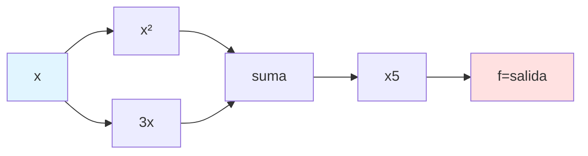
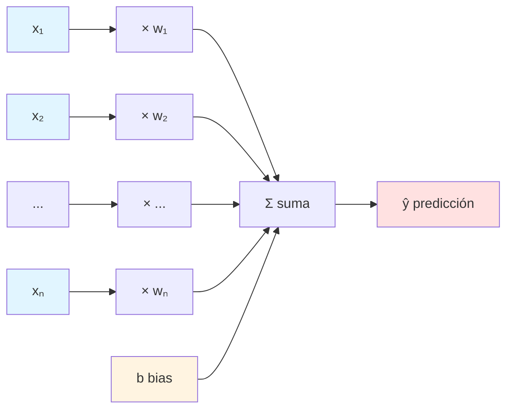
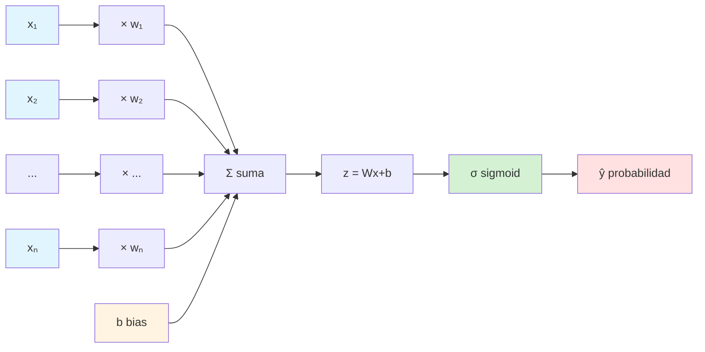
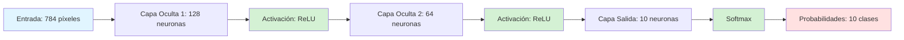
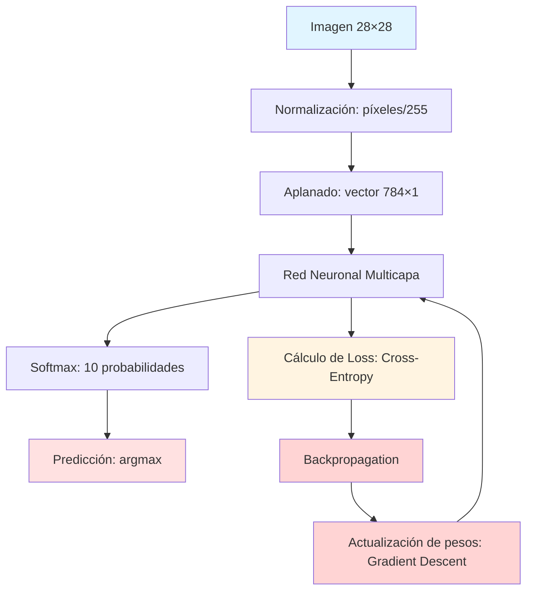

## 1. ¿Qué es una Neurona Artificial?

Una neurona artificial es la unidad básica de procesamiento en una red neuronal, inspirada en el funcionamiento biológico de las neuronas del cerebro. En términos matemáticos, una neurona artificial realiza las siguientes operaciones:

1. **Recibe múltiples entradas** $(x_1, x_2, ..., x_n)$, cada una representando una característica o señal de entrada

2. **Multiplica cada entrada por un peso** $(w_1, w_2, ..., w_n)$, que determina la importancia de cada entrada

3. **Suma todas las entradas ponderadas** y añade un término de sesgo (bias) $b$:

$$z = w_1x_1 + w_2x_2 + ... + w_nx_n + b$$

4. **Aplica una función de activación** $f(z)$ para introducir no-linealidad y producir la salida final

La neurona artificial puede expresarse matemáticamente como:

$$y = f\left(\sum_{i} w_ix_i + b\right)$$

**Donde:**
- $x$: vector de entradas
- $w$: vector de pesos (parámetros entrenables)
- $b$: sesgo (bias, parámetro entrenable)
- $f$: función de activación (ReLU, sigmoid, tanh, etc.)
- $y$: salida de la neurona

La neurona aprende ajustando sus pesos y sesgos durante el entrenamiento para minimizar el error entre sus predicciones y los valores reales.

---

## 2. Ejemplo de Gráfico Computacional

### Función: $f(x) = (x^2 + 3x) \times 5$

Un gráfico computacional es una representación visual de las operaciones matemáticas que se realizan en secuencia para calcular una función. Cada nodo representa una operación o variable, y las aristas muestran el flujo de datos.

### Gráfico Computacional de $f(x) = (x^2 + 3x) \times 5$

### Funcionamiento:

1. **Entrada**: $x$ es el valor de entrada
2. **Operación 1**: Calcular $x^2$ (elevar al cuadrado)
3. **Operación 2**: Calcular $3x$ (multiplicar por 3)
4. **Operación 3**: Sumar los resultados: $x^2 + 3x$
5. **Operación 4**: Multiplicar el resultado por 5
6. **Salida**: $f(x) = (x^2 + 3x) \times 5$

**Ejemplo numérico con** $x = 2$:
- $x^2 = 4$
- $3x = 6$
- $x^2 + 3x = 10$
- $10 \times 5 = 50$
- **Por lo tanto:** $f(2) = 50$

---

## 3. Gráficos Computacionales de Regresión Lineal y Logística

### 3.1 Regresión Lineal

La regresión lineal modela la relación entre variables de entrada y una salida continua mediante una función lineal.

**Ecuación general:**

$$\hat{y} = w_1x_1 + w_2x_2 + ... + w_nx_n + b = Wx + b$$

### Gráfico Computacional - Regresión Lineal

### Explicación del funcionamiento:

1. **Entradas**: Vector de características $x = [x_1, x_2, ..., x_n]$

2. **Pesos**: Cada entrada se multiplica por su peso correspondiente $w_i$

3. **Suma ponderada**: Se suman todos los productos $w_ix_i$

4. **Bias**: Se añade el término de sesgo $b$

5. **Salida**: $\hat{y}$ es la predicción continua (valor real)

**Función de pérdida típica - Error Cuadrático Medio (MSE):**

$$L = \frac{1}{n} \sum_{i=1}^{n}(y_i - \hat{y}_i)^2$$

---

### 3.2 Regresión Logística

La regresión logística extiende la regresión lineal para problemas de clasificación binaria, aplicando la función sigmoid para obtener probabilidades entre 0 y 1.

**Ecuación general:**

$$\hat{y} = \sigma(Wx + b) = \frac{1}{1 + e^{-(Wx + b)}}$$

### Gráfico Computacional - Regresión Logística

### Explicación del funcionamiento:

1. **Entradas**: Vector de características $x = [x_1, x_2, ..., x_n]$

2. **Suma ponderada**: $z = Wx + b$ (igual que regresión lineal)

3. **Función sigmoid**: Transforma $z$ en probabilidad

$$\sigma(z) = \frac{1}{1 + e^{-z}}$$

   - Convierte cualquier valor real en un rango $[0, 1]$
   - Interpretable como probabilidad $P(y=1|x)$

4. **Salida**: $\hat{y} \in [0, 1]$ representa la probabilidad de pertenecer a la clase positiva

5. **Decisión de clasificación**:
   - Si $\hat{y} \geq 0.5 \rightarrow$ clase 1
   - Si $\hat{y} < 0.5 \rightarrow$ clase 0

**Función de pérdida típica - Binary Cross-Entropy (BCE):**

$$L = -\frac{1}{n} \sum_{i=1}^{n} \left[y_i \log(\hat{y}_i) + (1-y_i) \log(1-\hat{y}_i)\right]$$

### Propiedades de la función sigmoid:

- $\sigma(0) = 0.5$ (punto medio)
- $\sigma(+\infty) \rightarrow 1$
- $\sigma(-\infty) \rightarrow 0$
- **Derivada**: $\sigma'(z) = \sigma(z)(1 - \sigma(z))$

---

## 4. Aplicación a Clasificación: Reconocimiento de Dígitos MNIST

### 4.1 ¿Qué es MNIST?

MNIST (Modified National Institute of Standards and Technology) es un conjunto de datos de dígitos escritos a mano (0-9), donde cada imagen es de $28 \times 28$ píxeles en escala de grises. Es un problema de clasificación multiclase (10 clases).

**Características del dataset:**
- 60,000 imágenes de entrenamiento
- 10,000 imágenes de prueba
- Dimensión de cada imagen: $28 \times 28 = 784$ píxeles
- Valores de píxeles: 0 (blanco) a 255 (negro)
- 10 clases: dígitos del 0 al 9

---

### 4.2 Cómo los Modelos Sirven como Base para MNIST

#### Regresión Lineal como Base

Aunque la regresión lineal por sí sola no es ideal para clasificación, establece los fundamentos:

1. **Vectorización de entrada**: Una imagen $28 \times 28$ se aplana en un vector de 784 características (píxeles)

2. **Transformación lineal**: $Wx + b$ proyecta las 784 características en un espacio de decisión

3. **Limitación**: No puede capturar relaciones no-lineales complejas en los píxeles

---

#### Regresión Logística para Clasificación Binaria

La regresión logística puede usarse de dos formas:

**1. Clasificación One-vs-All (OvA):**

Entrenar 10 clasificadores binarios independientes (uno por dígito):
- Clasificador 1: ¿Es un "0"? Sí/No
- Clasificador 2: ¿Es un "1"? Sí/No
- Clasificador 3: ¿Es un "2"? Sí/No
- ...
- Clasificador 10: ¿Es un "9"? Sí/No

La clase final es la que tenga mayor probabilidad entre los 10 clasificadores.

**2. Softmax Regression (extensión multiclase):**

Generalización directa de regresión logística para múltiples clases:

- **Función softmax**: Convierte 10 logits en probabilidades que suman 1

$$P(y=k|x) = \frac{e^{z_k}}{\sum_{j=1}^{10} e^{z_j}}$$

donde $z_k = W_k x + b_k$ es el logit para la clase $k$

- Cada clase tiene su propio conjunto de pesos: $W_0, W_1, ..., W_9$
- La clase predicha es: $\hat{y} = \arg\max_k P(y=k|x)$

---

#### Red Neuronal Multicapa (Mejora sobre Regresión Logística)

Para MNIST, una arquitectura típica es:

**Ventajas sobre regresión logística:**

1. **Capas ocultas**: Aprenden representaciones jerárquicas de características
   - **Primera capa**: Detecta bordes y líneas básicas
   - **Capas intermedias**: Combinan bordes en formas más complejas (curvas, esquinas)
   - **Capas finales**: Reconocen patrones específicos de cada dígito

2. **Funciones de activación no-lineales** (ReLU): Permiten aprender relaciones no-lineales complejas entre píxeles

3. **Mayor capacidad de modelado**: Múltiples capas de transformaciones permiten aprender patrones más sofisticados

**Ecuaciones de forward pass:**

Capa 1: $h_1 = \text{ReLU}(W_1 x + b_1)$

Capa 2: $h_2 = \text{ReLU}(W_2 h_1 + b_2)$

Salida: $\hat{y} = \text{Softmax}(W_3 h_2 + b_3)$

donde $\text{ReLU}(z) = \max(0, z)$

---

### 4.3 Pipeline Completo para MNIST

### Diagrama del Pipeline

### Proceso de Entrenamiento:

1. **Forward Pass**: Imagen → Red → Predicción
   - Propagar la entrada a través de todas las capas
   - Obtener probabilidades de salida

2. **Cálculo de Loss**: Comparar predicción con etiqueta real
   - Usar Cross-Entropy Loss:
   
$$L = -\sum_{k=1}^{10} y_k \log(\hat{y}_k)$$

   donde $y_k$ es 1 para la clase correcta y 0 para las demás

3. **Backward Pass (Backpropagation)**: Calcular gradientes
   - Calcular $\frac{\partial L}{\partial W}$ para cada peso
   - Propagar gradientes desde la salida hacia la entrada

4. **Actualización de Pesos**: Usar descenso por gradiente
   
$$W \leftarrow W - \eta \frac{\partial L}{\partial W}$$

   donde $\eta$ es la tasa de aprendizaje (learning rate)

5. **Repetir** por múltiples épocas hasta convergencia

---

### Métricas de Evaluación:

1. **Accuracy (Exactitud)**:
   
$$\text{Accuracy} = \frac{\text{Predicciones correctas}}{\text{Total de predicciones}}$$

2. **Confusion Matrix**: Matriz $10 \times 10$ que muestra:
   - Filas: Clases verdaderas
   - Columnas: Clases predichas
   - Permite identificar qué dígitos se confunden entre sí

3. **Loss**: Cross-entropy loss en conjunto de validación
   - Mide qué tan bien calibradas están las probabilidades
   - Valores más bajos indican mejor ajuste

---

### 4.4 Comparación de Modelos y Conclusión

### Rendimiento en MNIST:

| Modelo | Arquitectura | Accuracy | Observaciones |
|--------|--------------|----------|---------------|
| Regresión Logística Softmax | 784 → 10 | ~92% | Simple, rápido, baseline |
| Red Neuronal Multicapa | 784 → 128 → 64 → 10 | ~98% | Mejor capacidad de generalización |
| Redes Convolucionales (CNN) | Conv → Pool → FC → 10 | >99% | Estado del arte, explota estructura espacial |

### Conclusión:

La regresión lineal y logística establecen los fundamentos matemáticos que se extienden a redes neuronales profundas:

- **Suma ponderada**: $Wx + b$ es la operación básica en todas las capas
- **Optimización por gradiente**: Backpropagation + descenso por gradiente
- **Funciones de activación**: Introducen no-linealidad necesaria para problemas complejos

**Para MNIST específicamente:**

Las redes neuronales superan a la regresión logística al:
1. **Aprender automáticamente características relevantes** de las imágenes
2. **Utilizar múltiples capas** de transformaciones no-lineales
3. **Capturar patrones jerárquicos** desde características simples hasta complejas

**Evolución histórica:**
- Décadas 1990-2000: Regresión logística y SVMs dominaban
- 2010s: Redes neuronales profundas revolucionaron el campo
- Actualidad: Arquitecturas especializadas (CNNs, Transformers) logran rendimiento casi perfecto

---

